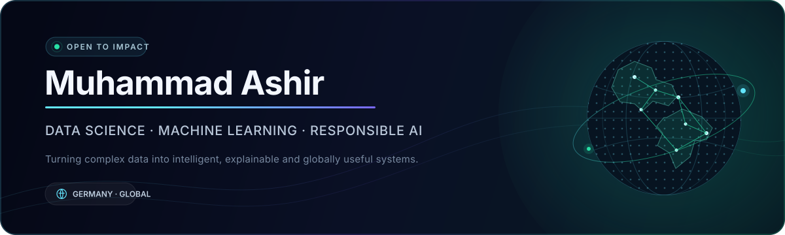

<div align="center">
  

  <br />

  [](https://datascienceportfol.io/ashirali0998)
  [](https://de.linkedin.com/in/muhammadashir1)
  [](https://github.com/muhammadashir0)

  **Master's Student · Data Scientist · Machine Learning Practitioner**

  <sub>Based in Germany · Building for a global audience</sub>
</div>

<br />

## The mission

I turn raw data into **clear decisions, reliable models, and responsible AI systems**. My work sits at the intersection of data science, machine learning, deep learning, and AI governance—with a focus on solutions that are useful beyond the notebook.

```text
DISCOVER  →  clean, explore, and understand complex data
BUILD     →  train and evaluate practical machine-learning systems
EXPLAIN   →  make model behavior transparent and accountable
DELIVER   →  communicate findings as decisions people can act on
```

## Current focus

<table>
<tr>
<td width="33%" valign="top">

### Responsible AI
Exploring fairness, explainability, robustness, and audit-ready ML—especially in the context of the EU AI Act.

</td>
<td width="33%" valign="top">

### Applied ML
Building end-to-end workflows from exploration and feature engineering to evaluation and communication.

</td>
<td width="33%" valign="top">

### Deep Learning
Developing practical knowledge of PyTorch and modern transformer-based systems across real-world use cases.

</td>
</tr>
</table>

## Selected work

<table>
<tr>
<td width="50%" valign="top">

### ◈ [RegLedger AI](https://github.com/muhammadashir0/regledger-ai)

**FinTech · LLM/RAG · Responsible AI**

An evidence-first financial-compliance copilot combining explainable transaction-risk triage, policy-grounded answers, human oversight, and a tamper-evident audit trail.

`Python` `LLM/RAG` `Explainable AI` `FinTech`

**Status:** Published working MVP · [Explore the repository →](https://github.com/muhammadashir0/regledger-ai)

</td>
<td width="50%" valign="top">

### 🎬 [Netflix EDA](https://github.com/muhammadashir0/netflix-eda)

**Exploratory Analysis · Data Storytelling**

An end-to-end exploration of Netflix titles covering data cleaning, content distribution, production markets, release patterns, and ratings.

`Pandas` `NumPy` `Matplotlib` `Jupyter`

[View the analysis →](https://github.com/muhammadashir0/netflix-eda/blob/main/Netflix_EDA.ipynb)

</td>
</tr>
</table>

> **What I bring:** analytical depth, a responsible-AI mindset, and the ability to translate technical results into a clear story.

## AI × FinTech lab

My project pipeline targets difficult financial problems where language models need evidence, evaluation, and accountable human oversight—not just a chat interface.

| Project | Product idea | Core intelligence | Stage |
|---|---|---|---|
| **RegLedger AI** | Evidence-first compliance copilot and transaction-risk studio | Grounded LLM/RAG · explainable risk · audit chain | **MVP built** |
| **CovenantGraph** | Turns loan agreements into a temporal covenant graph with early-breach warnings | Document AI · structured extraction · graph reasoning | Planned |
| **Counterfactual Credit Lab** | Generates feasible, fairness-aware pathways behind credit outcomes | Interpretable ML · counterfactuals · fairness | Planned |
| **Cashflow Twin** | Simulates financial shocks and choices with probabilistic cash-flow forecasts | Time series · scenario engine · local LLM | Concept |
| **FilingDiff Agent** | Finds material changes across annual reports with two-sided citations | Multimodal RAG · tables · claim verification | Concept |
| **ScamGraph Sentinel** | Explains authorized-payment scam risk before transfer confirmation | Graph ML · NLP · calibrated alerts | Concept |

<sub>Planned projects are labeled honestly and will be promoted to selected work only after code, evaluation, and documentation are published.</sub>

## Technology landscape

<div align="center">

**Core**


**Workflow**


</div>

## GitHub at a glance

<div align="center">
  
  
</div>

<div align="center">
  
</div>

## Let's build something useful

I am interested in **data science, applied machine learning, responsible AI, and open-source collaboration**. If your work turns complex data into measurable impact, I would be glad to connect.

<div align="center">

[](https://de.linkedin.com/in/muhammadashir1)
[](https://datascienceportfol.io/ashirali0998)

<sub>Data with clarity · Models with purpose · AI with responsibility</sub>

</div>
