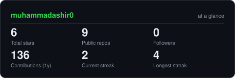
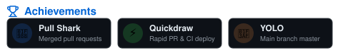
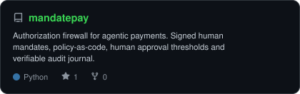
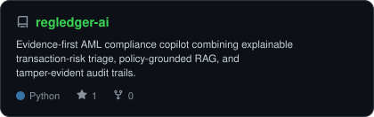
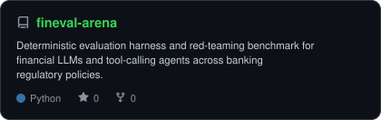
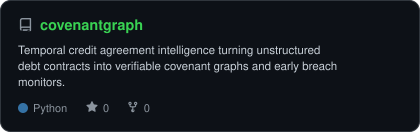

<div align="center">

<!-- PORTRAIT - generated by scripts/dotify.py from assets/avatar.png -->


<br>

<!-- NAME / TAGLINE - animated typing -->
<a href="https://github.com/muhammadashir0">
  
</a>

<br>

<!-- SOCIALS -->
<a href="https://de.linkedin.com/in/muhammadashir1"></a>
<a href="mailto:ashirali0998@gmail.com"></a>
<a href="https://datascienceportfol.io/ashirali0998"></a>
<a href="https://github.com/muhammadashir0"></a>


</div>

---

## `~/` whoami

```console
$ cat about.txt
```

Hi, I'm **Muhammad Ashir**. I build resilient AI systems, agentic financial infrastructure, and deterministic evaluation engines that bridge the gap between machine intelligence and regulated banking rails.

- Currently building **[MandatePay](https://github.com/muhammadashir0/mandatepay)** and **[RegLedger AI](https://github.com/muhammadashir0/regledger-ai)**
- Portfolio: **[datascienceportfol.io/ashirali0998](https://datascienceportfol.io/ashirali0998)**
- Core research & systems: **Financial LLMs · Policy-as-Code · Agent Guardrails · RAG & LLMOps**
- Location: **Germany (Frankfurt / Ilmenau)**
- Operating philosophy: **"Autonomous agents shouldn't hold the company credit card without cryptographic guardrails."**

<br>

<div align="center">

## `~/` toolbox


</div>

---

<div align="center">

## `~/` skill radar

<table>
<tr>
<td width="50%" align="center" valign="middle">

<!-- Self-rated radar - edit assets/skills.json, the workflow redraws it -->
<picture>
  <source media="(prefers-color-scheme: dark)"  srcset="assets/radar-dark.svg">
  <source media="(prefers-color-scheme: light)" srcset="assets/radar-light.svg">
  
</picture>

</td>
<td width="50%" align="center" valign="middle">

<!-- Language & stack radar - synced live from repo bytes / assets/languages.json -->
<picture>
  <source media="(prefers-color-scheme: dark)"  srcset="assets/radar-langs-dark.svg">
  <source media="(prefers-color-scheme: light)" srcset="assets/radar-langs-light.svg">
  
</picture>

</td>
</tr>
</table>

</div>

---

<div align="center">

## `~/` contribution calendar

<!-- 3D isometric calendar, regenerated every 6h by .github/workflows/metrics.yml -->


<br><br>

<!-- Snake eats the contribution graph - .github/workflows/snake.yml -->
<picture>
  <source media="(prefers-color-scheme: dark)"  srcset="https://raw.githubusercontent.com/muhammadashir0/muhammadashir0/output/snake-dark.svg">
  <source media="(prefers-color-scheme: light)" srcset="https://raw.githubusercontent.com/muhammadashir0/muhammadashir0/output/snake.svg">
  
</picture>

</div>

---

<div align="center">

## `~/` the numbers

<!-- Generated by scripts/cards.py into this repo -->
<picture>
  <source media="(prefers-color-scheme: dark)"  srcset="assets/card-stats-dark.svg">
  <source media="(prefers-color-scheme: light)" srcset="assets/card-stats-light.svg">
  
</picture>

<br>


<br><br>



</div>

---

<div align="center">

## `~/` selected work

<!-- Cards generated by scripts/cards.py from assets/projects.json -->
<table>
<tr>
<td width="50%">
  <a href="https://github.com/muhammadashir0/mandatepay">
    <picture>
      <source media="(prefers-color-scheme: dark)"  srcset="assets/card-mandatepay-dark.svg">
      <source media="(prefers-color-scheme: light)" srcset="assets/card-mandatepay-light.svg">
      
    </picture>
  </a>
</td>
<td width="50%">
  <a href="https://github.com/muhammadashir0/regledger-ai">
    <picture>
      <source media="(prefers-color-scheme: dark)"  srcset="assets/card-regledger-ai-dark.svg">
      <source media="(prefers-color-scheme: light)" srcset="assets/card-regledger-ai-light.svg">
      
    </picture>
  </a>
</td>
</tr>
<tr>
<td width="50%">
  <a href="https://github.com/muhammadashir0/fineval-arena">
    <picture>
      <source media="(prefers-color-scheme: dark)"  srcset="assets/card-fineval-arena-dark.svg">
      <source media="(prefers-color-scheme: light)" srcset="assets/card-fineval-arena-light.svg">
      
    </picture>
  </a>
</td>
<td width="50%">
  <a href="https://github.com/muhammadashir0/covenantgraph">
    <picture>
      <source media="(prefers-color-scheme: dark)"  srcset="assets/card-covenantgraph-dark.svg">
      <source media="(prefers-color-scheme: light)" srcset="assets/card-covenantgraph-light.svg">
      
    </picture>
  </a>
</td>
</tr>
</table>

<sub>

| project | focus | stack |
|---|---|---|
| **[MandatePay](https://github.com/muhammadashir0/mandatepay)** | Agent Payments Authorization Firewall & Control Plane | `Python` `MCP` `HMAC` `Policy Engine` |
| **[RegLedger AI](https://github.com/muhammadashir0/regledger-ai)** | Evidence-First AML Compliance Copilot & Transaction Triage | `Python` `RAG` `Audit Chain` `FastAPI` |
| **[FinEval Arena](https://github.com/muhammadashir0/fineval-arena)** | Financial LLM Benchmark & Agent Red-Teaming Harness | `Python` `LLM Eval` `PyTorch` `JSON-Schema` |
| **[CovenantGraph](https://github.com/muhammadashir0/covenantgraph)** | Temporal Debt Agreement Intelligence & Breach Graph | `Python` `Graph ML` `Document AI` `NetworkX` |

</sub>

</div>

---

<div align="center">

<sub>`01110100 01101000 01100001 01101110 01101011 01110011 00100000 01100110 01101111 01110010 00100000 01110011 01100011 01110010 01101111 01101100 01101100 01101001 01101110 01100111`</sub>

</div>
